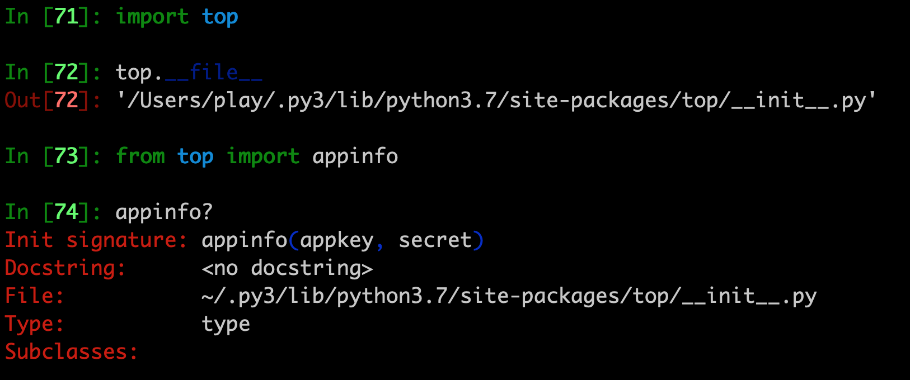

# 淘宝客-淘宝联盟-阿里妈妈 topsdk

- 其他平台
    - [京东联盟](https://pypi.org/project/jd-union/)
    - [拼多多](https://github.com/makelove/DDK_SDK)

- 视频教程-列表
    - [B站搜索:程序员赚钱指南 淘宝](https://search.bilibili.com/video?keyword=%E7%A8%8B%E5%BA%8F%E5%91%98%E8%B5%9A%E9%92%B1%E6%8C%87%E5%8D%97%20%E6%B7%98%E5%AE%9D&order=pubdate&duration=0&tids_1=0)
    - 最新视频 2020-2-28 [返现！淘宝客top_sdk使用指南，没有权限怎么搞？](https://www.bilibili.com/video/av92205510/)

- [微信客户端](./WeiXin) 失效,旧版本安装后强制升级，不能使用。

- 文档
    - 官方-淘宝客API https://open.taobao.com/api.htm?docId=24515&docType=2
    - [阿里开放平台－控制台](http://console.open.taobao.com/app/appList.htm#/app/manager)
    - 淘宝开放平台 [文档搜索入口](https://open.taobao.com/search.htm)
        - 例如 阿里妈妈推广券信息查询，搜索：taobao.tbk.coupon.get
            - https://open.taobao.com/search.htm?q=taobao.tbk.coupon.get

- 最新消息
    - 2020-02-01
        - [[官方公告] 重要！淘宝联盟开发者中心上线啦！快速申请权限](https://open.alimama.com/#!/solution?id=12&url=33)
    - 2019-04-01
        - [淘宝客新等级体系正式上线&FAQ专场](https://tbk.bbs.taobao.com/detail.html?spm=a219t.7900221/1.1998910419.de4e1af6f0.6edb75a58McTjx&postId=9119458)
    - 2019-02-20
        - [推广位创建总数不超过200个](https://tbk.bbs.taobao.com/detail.html?spm=a219t.7900221/1.1998910419.39.6edb75a58McTjx&appId=45301&postId=9102740)
    - 2019-01-16
        - [《淘宝客私域用户管理》-新手指南](https://mo.m.taobao.com/pdum)
    - 2018-05-28
        - [史上最详细淘宝联盟API使用教程](https://tbk.bbs.taobao.com/detail.html?postId=8576944)
        - [官方推荐商品库大全（提供最新API获取方式）](https://tbk.bbs.taobao.com/detail.html?appId=45301&postId=8576096)
    - 2017-10-16
        - [淘宝联盟选品组&定向招商API开发指南](https://tbk.bbs.taobao.com/detail.html?spm=a219t.7900221/10.0.0.17d575a5L64RTj&appId=45301&postId=8113156)

| key | 含义 |
| ------ | ------ |
| pict_url | 商品主图 |
| reserve_price | 商品一口价格 |
| zk_final_price | 商品折扣价格 |
| volume | 30天销量 |
| provcity | 宝贝所在地  发货地 |
| user_type | 卖家类型，0表示淘宝集市，1表示天猫商城 |

- 从淘宝下载的top，python是2.7的，满是bug
    - 现在已经修改为python 3.6
- Enjoy！
    - 有一些api没有加入，因为下载sdk时，淘宝是根据你的权限自动生成的。
    - 有时候新增加了一些api，也不知道

- 更新update
    - 2018.11.1
        - 在【阿里开放平台－控制台】下载Java sdk 发现更新了。需要【点击生成】，无语！
        - 新增了 TbkShopConvertRequest TbkScOptimusMaterialRequest
        - 很有用的api是TbkTpwdConvertRequest
            - 支持通过淘口令解析商品id，并提供对应的淘客转链接
            - 反向解析：淘口令-->s.click.taobao.com链接
            - 把别人的淘口令转成自己的淘口令
            -  跟 TbkTpwdCreateRequest 相反

- 安装
    - 请用pip安装
        - https://pypi.org/project/topsdk/
        - 用这个: pip install topsdk
        - 更新
            - pip install topsdk --upgrade
        - 卸载
            - pip uninstall topsdk
    - 如果没有pip和配置虚拟合计virtualenv
        - python setup.py clean
        - python setup.py install
    - 成功安装后，验证：
    - 
    - .py3是我的virtualenv虚拟环境

- 应用
    - 利用【大淘客CMS】建站 http://www.dataoke.com/cms-introduce.html
        - 可以用它新建一个网站，获取API权限
        - 演示DEMO http://www.yangchun.so/
        - 帮助文档 http://help.dataoke.com/hc/kb/category/1012170/
        - [大淘客CMS系统如何使用](http://help.dataoke.com/hc/kb/article/1128855/)
            - 大淘客CMS系统使用首先需要拥有自己的网站，最基础就是有空间和域名，建议空间最好是支持PHP5.4及以上的，同时购买域名时请确认备案域名和注册域名一致，如出现差异是无法使用大淘客CMS系统的。
        - 缺点:
            - 不支持HTTPS,会被劫持流量
            - 可能会偷单
            - 每隔一段时间，需要更新`授权`
            - 用了4个月了，感觉稳定
                - 用户流量需要自己推广，不是一劳永逸，躺着赚钱。
    - App
    - 公众号-订阅号
        - 参考-公众号:真AI人工智能
    - 微信小程序
        - 微信官方暗地里禁止淘宝推广
        - 要小心被下架，更新审核时被拒
    - [微信客户端](./WeiXin)
        - 用户发淘口令或淘宝链接
        - 直接回复转链后的淘口令

- 交流   
    - 解析淘口令-服务，请联系我
    - 加我微信:sexy8dream
        - 

    - 扫码进群。失效。先加微信
        - 

